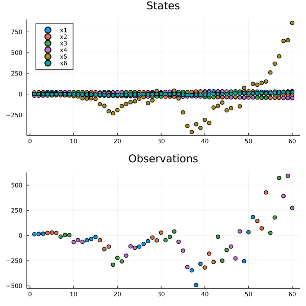

# STSlib.jl

[](https://codecov.io/gh/SebastianCallh/STSlib.jl)

STSlib.jl provides primitives for constructing structural time series.

# Examples
This section showcases package functionality with some code snippets.

## Basics

We can construct a model and call it to get the observation matrix `H`, transition matrix `F` and transition noise covariance matrix `Q`.
Below, we create a `LocalLinear` model and generate its matrices for a given timestep.

```julia
using STSlib, GaussianDistributions, Random

level_drift_scale = 1
slope_drift_scale = 0.5
sts = LocalLinear(level_drift_scale, slope_drift_scale)
timestep = 1 
H, F, Q = sts(timestep)
```

These can be used to simulate observations deterministically

```julia
x0 = [1., 1.] # initial state
x1 = F*x0     # state transition 
y1  = H*x1    # emit new observation
```

or stochastically (assuming Gaussian transition noise)

```julia
x0 = [1., 1.]                # initial state
x1 = rand(Gaussian(F*x0, Q)) # state transition 
y1  = F*x1                   # emit new observation
```

For convenience the package provides a `simulate` function which can be used to to this iteratively.

```julia
x0 = [1., 1.]  # initial state
Σ = [0.01;;]   # observation noise covariance
T = 10         # number of steps to simulate
xs, ys = simulate(sts, T, x0, Σ)

x_plt = scatter(xs', label=reshape(["x$i" for i in 1:size(xs, 1)], 1, :), title="State", legend=:topleft)
y_plt = scatter(ys', label=nothing, title="Observations")
plot(x_plt, y_plt, layout=(2, 1), size=(600, 800))
```


## Composition
We are also able to compose components into larger components.
For instance, we create an additive STS model with a local linear component and seasonality by simply adding `LocalLinear` and `Seasonal` components.

```julia
Random.seed!(1234)
level_drift_scale = 1
slope_drift_scale = 0.5
num_seasons = 4
season_length = 3
season_drift_scale = 1
sts = Seasonal(num_seasons, season_length, season_drift_scale) + LocalLinear(level_drift_scale, slope_drift_scale)

# simulate as usual
x0 = [10., 20., -10., -20, 1., 1.]
Σ = [0.01;;]
num_occurences = 5
seasons = repeat(collect(1:num_seasons), inner=season_length, outer=num_occurences)
T = length(seasons)
xs, ys = simulate(sts, T, x0, Σ)

x_plt = scatter(xs', label=reshape(["x$i" for i in 1:size(xs, 1)], 1, :), title="State", legend=:topleft)
y_plt = scatter(ys', color=seasons, label=nothing, title="Observations")
plot(x_plt, y_plt, layout=(2, 1), size=(600, 800))
```

