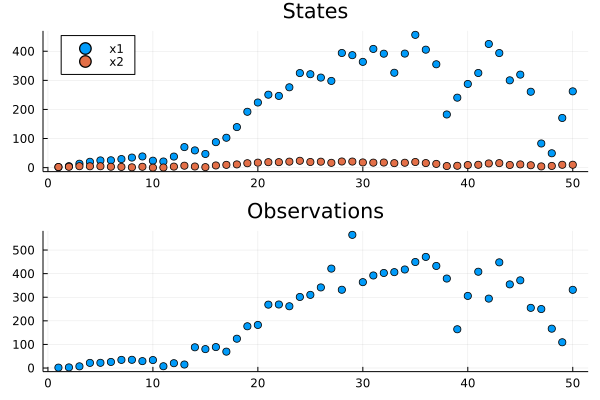

# STSlib.jl

[](https://codecov.io/gh/SebastianCallh/STSlib.jl)

STSlib.jl is a library for structural time series (STS) primitives.
An STS is a model in which we can encode prior information,
such as trends and seasonality, which can then be projected into the future to make forecasts.
In a nutshell, this package contains functionality 
to construct such models without having to care about the underlying linear algebra.


## Mathematical details
An STS (at least according to this package) is a model with a latent variable $x \in \mathcal{R}^M$ and an observed variable $y \in \mathcal{R}^N$ that evolve over discrete time steps according to 

$$
x_{t} = Fx_{t-1} + \eta_t, \eta_t \sim \mathcal{N}(0, Q_t)
$$

$$
y_{t} = Hx_{t} + \epsilon, \epsilon \sim \mathcal{N}(0, P),
$$

where $F_t$ is an $M \times M$ *transition matrix* describing the transition of the state $x$,
$Q_t$ an $M \times M$ covariance matrix capturing the uncertainty of the transition, 
and $F$ an $N \times M$ *observation matrix* describing how observations $y$ are generated from $x$.
Finally, $P$ is the covariance matrix or the observation noise.

Constructing STSs boil down to designing $F_t$, $H_t$ $Q_t$ and this package aims to provide flexible tools for doing that without having to manually write down problem specific matrices.

# Examples
This section showcases package functionality with some code snippets.

## Basics

When using this package you most likely want to start with creating an STS model. You can then use the functions `transition` to map state $x_t$ to $x_{t+1}$ and `observe` to map $x_t$ to $y_t$.
Both of these functions are available both as deterministic or probabilistic (assuming Gaussian variables) versions.
Below, we create a `LocalLinear` model and compute future states and observations.

```julia
using STSlib, Random, LinearAlgebra, Plots

level_drift_scale = 1.
slope_drift_scale = 0.5
sts = LocalLinear(level_drift_scale, slope_drift_scale)
x₀ = [1., 1.]
x₁ = transition(sts, x₀)
```

For probabilistic transitions simply pass the covariance matric $P$ as an additional argument.

```julia
x₀ = [1., 1.]
P₀ = diagm(ones(length(x₀)))
x₁, P₁ = transition(sts, x₀, P₀)
```

Some components depend on the current time step $t$, like the `Seasonal` one.

```julia
num_seasons = 4
season_length = 1
drift_scale = 0.5
sts = Seasonal(num_seasons, season_length, drift_scale)
x₀ = ones(num_seasons)
t = 1
x₁ = transition(sts, x₀, t)
```

Prhaps you want to compute many future states all at once. 
To this end the package exposes the `simulate` function which will roll out future states and observations given a (probabilistic) initial state.

```julia
Random.seed!(1234)
level_drift_scale = 1.
slope_drift_scale = 0.5
sts = LocalLinear(level_drift_scale, slope_drift_scale)

x₀ = [1., 1.]       # initial state mean
P₀ = [1. 0.; 0. 1.] # initial state covariance
σ = 0.01            # observation noise
steps = 50          # number of steps to simulate
xs, ys = simulate(sts, steps, x₀, P₀, σ)

labels = reshape(["x$i" for i in 1:size(xs, 1)], 1, :)
x_plt = scatter(xs', label=labels, title="States", legend=:topleft)
y_plt = scatter(ys', label=nothing, title="Observations")
plot(x_plt, y_plt, layout=(2, 1))
```



## Composition
We are also able to compose components into larger components.
For instance, we create an additive STS model with a local linear component and seasonality by simply adding `LocalLinear` and `Seasonal` components.

```julia
Random.seed!(1234)
level_drift_scale = .1
slope_drift_scale = 0.5
num_seasons = 4
season_length = 3
season_drift_scale = 1
sts = Seasonal(num_seasons, season_length, season_drift_scale) +
  LocalLinear(level_drift_scale, slope_drift_scale)

# simulate as usual
x₀ = [10., 20., -10., -20, 1., 1.]
P₀ = diagm(ones(length(x₀)))
σ = 0.01
num_occurences = 5
seasons = repeat(collect(1:num_seasons), inner=season_length, outer=num_occurences)
steps = length(seasons)
xs, ys = simulate(sts, steps, x₀, P₀, σ)

labels = reshape(["x$i" for i in 1:size(xs, 1)], 1, :)
x_plt = scatter(xs', label=labels, title="States", legend=:topleft)
y_plt = scatter(ys', color=seasons, label=nothing, title="Observations")
plot(x_plt, y_plt, layout=(2, 1), size=(600, 600))
```


